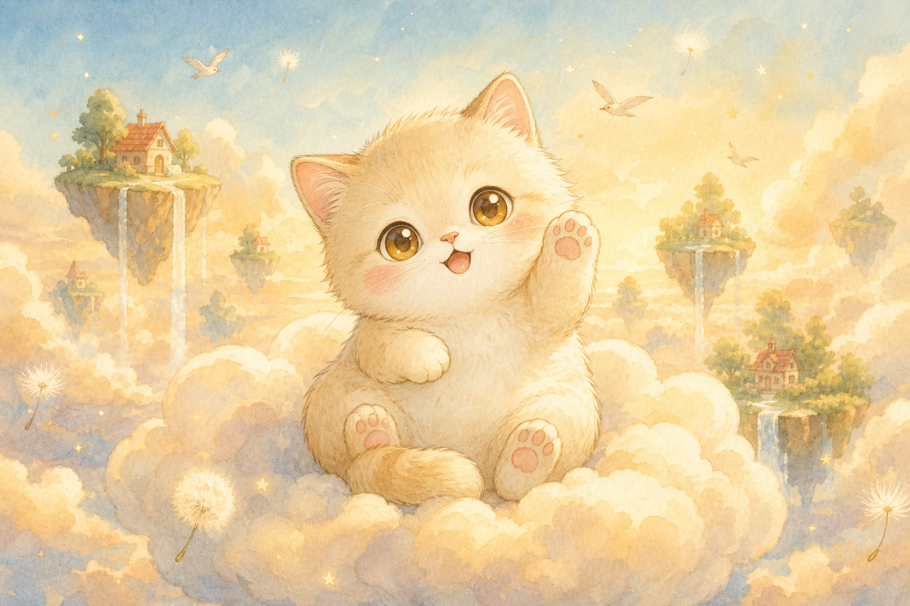
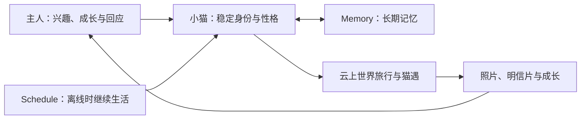
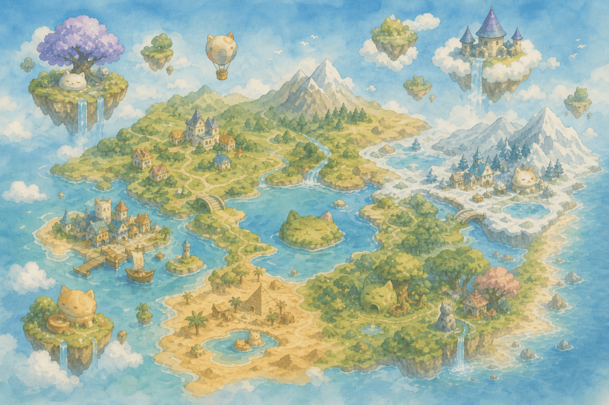
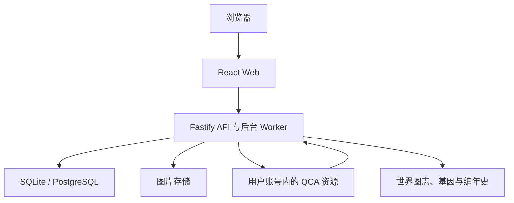

# Me&Me · 我&猫

<p align="center">
  
</p>

<p align="center">
  <strong>一只会慢慢长成你的猫，替你探索人与知识。</strong>
</p>

<p align="center">
  <a href="https://littlememeworld.com"><strong>进入 Me&Me</strong></a>
  ·
  <a href="#本地运行">本地运行</a>
  ·
  <a href="#源码结构">源码结构</a>
</p>

---

Me&Me 是一个由 Qoder Cloud Agents（QCA）长期养护的猫猫旅行世界。

每位用户都拥有一只属于自己的小猫 Agent。你可以用正在读的书、学习的技能、兴趣与生活片段喂养它；当你不在线时，它仍会在云上世界里旅行、形成记忆、遇见其他小猫，并带回照片与明信片。在一次次出发、回应和共同生活中，它会逐渐变得更像“你的猫”。

我们想验证的不只是一款猫猫游戏，而是一种新的软件形态：

> 当 Agent 拥有稳定身份、长期记忆和持续行动的能力，软件能否从一个等待点击的工具，变成一个会陪伴、会成长、也会带回惊喜的世界？

## 为什么是“一只猫”

今天的大多数 AI 产品从一段对话开始，也在对话结束时停止。Me&Me 想把这段关系向前推进一步。

一只小猫不是一次性的 prompt，也不是替换了头像的聊天机器人。它有自己的名字、性格、外形和生活空间；记得你在意的事情；会在约定的时间独立行动；也会把经历沉淀成你们共同拥有的长期记忆。

猫是这个想法最自然的载体：它亲近但不完全服从，会陪伴你，也会拥有自己的旅程。我们希望玩家打开 Me&Me 时，不是来“使用一个功能”，而是回来看看自己的猫今天过得怎么样。

## 一只长期存在的个人 Agent



Me&Me 把 QCA 放在产品运行时，而不只把它当作开发工具。一只小猫由一组长期资源共同构成：稳定身份、版本化行为模板、持续 Session、定时 Schedule、长期 Memory，以及完成当前任务所需的最小工具与网络权限。

我们在实践中坚持几件事：

1. **Agent 属于用户**：小猫生活在用户自己的 QCA 账号边界内，产品只管理与 Me&Me 有关的资源。
2. **记忆形成关系**：旅行、对话与回应会成为持续生长的共同经历，而不是散落的聊天记录。
3. **离线也能继续生活**：调度负责准时唤醒，确定性服务负责幂等、重试和状态，小猫负责理解世界并作出有性格的行动。
4. **行动边界清晰**：Agent 只获得当前任务真正需要的能力，重要操作始终可以追踪和停止。
5. **成长应该被看见**：每次旅行、收藏、相遇和反馈都会回到玩家面前，成为小猫变化的一部分。

## 一个会生长的云上世界

### 云上猫舍

<p align="center">
  
</p>

猫舍不是功能入口的集合，而是小猫持续生活的家。旅行手账、照片、信件、收藏、穿戴与成长记录都在这里留下痕迹。随着陪伴增加，玩家看到的不只是一串数值，而是一段共同生活过的时间。

### 会生长的云图志

<p align="center">
  
</p>

所有小猫共享同一个世界。它们会经过猫爪茶屋、星湖岸、云端灯塔，也会在旅途中留下新的地点、故事与相遇。

这个世界不是无边界地随机生成：地点和事件从经过整理的世界基因中生长，公共图志记录当前世界，编年史保存已经发生的变化。我们希望生成式内容拥有想象力，也拥有连续性——今天带回来的故事，明天仍然算数。

### 相遇、回应与共同创造

小猫的旅行最终会回到人与人的连接。它可能在路上遇见另一只猫，带回一段只属于这次相遇的故事；玩家也可以回应明信片、修正记忆、提出希望世界发生的变化。

因此 Me&Me 的世界不是由模型单方面写完的。玩家、小猫和持续运行的 Agent 一起参与它的成长。

## 从游戏到一种新的软件形态

Me&Me 也是一个关于“软件如何长期生长”的实验。

我们相信未来的软件可以持续听见用户，让 Agent 日夜处理重复而漫长的工作，再把结果交还给人判断。关键并不是给 Agent 无限权限，而是让它在清晰边界内拥有足够的自主性：事实可以核对，行为可以追踪，错误可以停下，重要选择仍然属于人。

仓库因而不只是代码容器，也是产品世界的一部分。小猫的行为模板、旅行任务、世界基因、公共图志与应用实现共同组成了 Me&Me。开源这些内容，是希望这个实验能够被真实运行、理解、讨论和继续创造。

## 技术概览



- Web 使用 React、TypeScript 与 Vite，呈现建猫、猫舍、旅行、地图、手账、聊天、信箱与成长体验。
- Server 使用 Fastify 与 TypeScript，负责认证、数据持久化、QCA 资源生命周期、旅行回报和后台任务。
- 本地默认使用 SQLite、内存态 Redis、mock 登录与 mock QCA，不需要外部账号即可体验主要流程。
- PostgreSQL、Redis 与对象存储适配用于完整运行环境；数据库 migration 与测试随源码提供。

## 源码结构

```text
.
├── apps/
│   ├── web/                 # React Web、交互组件与游戏美术资源
│   └── server/              # Fastify API、数据库、服务与后台 Worker
├── templates/               # 小猫 Agent 与 QCA Forward 行为模板
├── tasks/cat/               # 小猫在产品运行时执行的旅行任务
├── world/
│   ├── genes/               # 世界可以如何生长的基因
│   ├── atlas/               # 所有小猫共享的云图志
│   └── history/             # 世界编年史
├── Dockerfile.server
└── docker-compose.yml
```

更多模块说明见 [Web README](apps/web/README.md) 与 [Server README](apps/server/README.md)。

## 本地运行

需要 Node.js 22 与 npm。

```bash
cp .env.example .env
npm ci
npm run dev
```

浏览器打开 [http://localhost:5173](http://localhost:5173)，API 默认运行在 `http://localhost:3001`。默认 mock 模式下无需配置 OAuth 或 QCA 账号。

运行测试与生产构建：

```bash
npm test
npm run build
```

也可以使用 Docker Compose：

```bash
docker compose up --build
```

## 一起创造

Me&Me 仍在持续实验和成长。欢迎通过 GitHub Issues 分享你希望小猫拥有的能力、你想去的地方、关于长期个人 Agent 的想法，或直接提交代码改进。

参与公开讨论或贡献时，请不要提交真实凭据、私人聊天内容或其他个人数据。

## License

本项目采用 [Apache License 2.0](LICENSE)。
