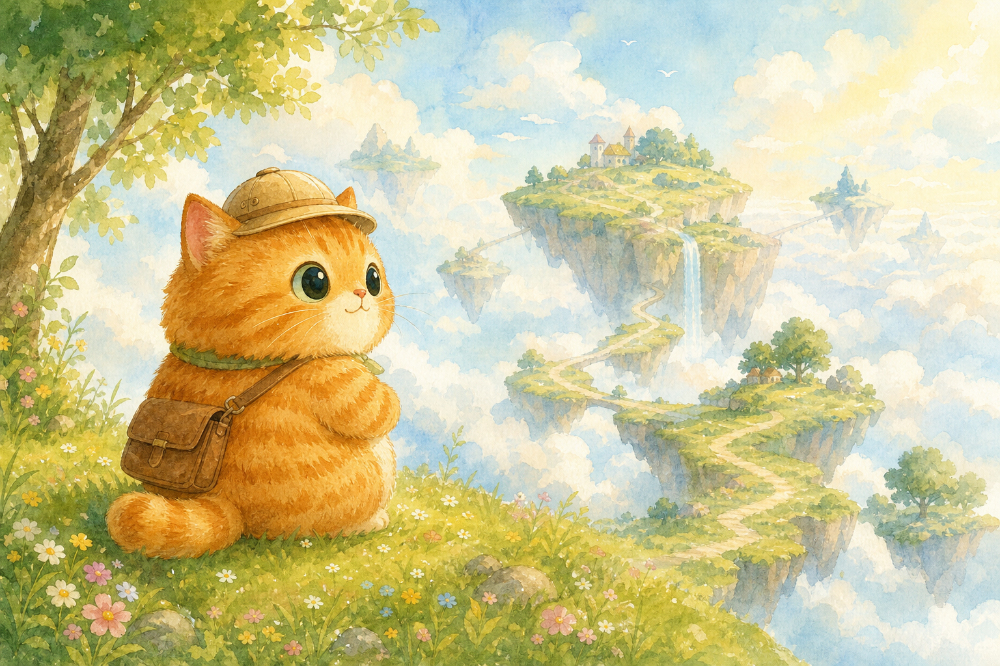
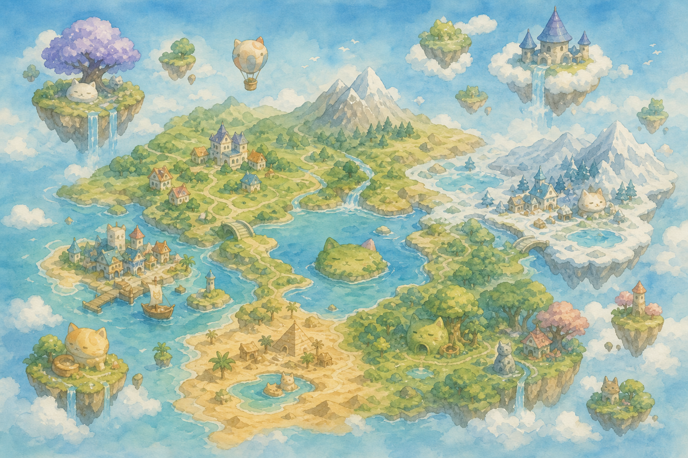
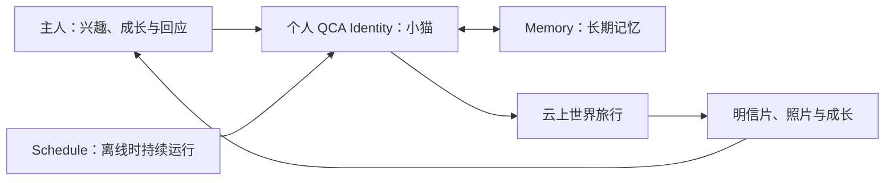
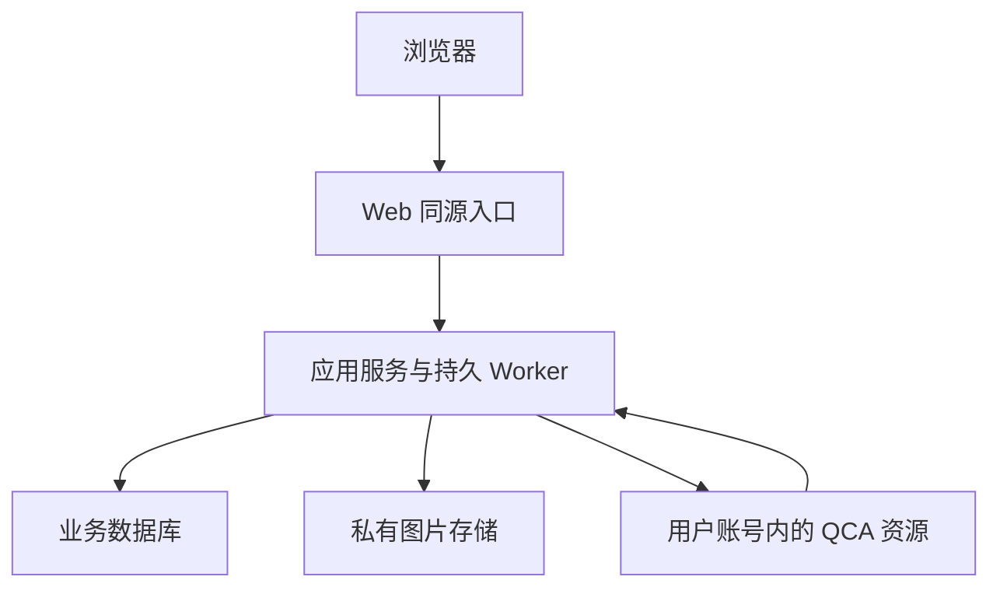

# Me&Me · 我&猫

<p align="center">
  
</p>

<p align="center">
  <strong>一只会慢慢长成你的猫，替你探索人与知识。</strong>
</p>

<p align="center">
  <a href="https://littlememeworld.com"><strong>进入 Me&Me</strong></a>
  ·
  <a href="docs/qca-best-practices.md">QCA 最佳实践</a>
  ·
  <a href="docs/software-self-evolution.md">软件自进化实验</a>
</p>

---

Me&Me 是一个由 Qoder Cloud Agents（QCA）长期养护的自进化旅行世界。

每位用户拥有一只属于自己的小猫 Agent。你可以用正在读的书、学习的技能、兴趣与生活片段喂养它；当你不在线时，它仍会在云上世界里旅行、形成记忆、带回明信片，并在一次次互动中变得更像“你的猫”。

但我们真正想验证的，不只是一款猫猫游戏，而是一种新的软件形态：

> 未来的软件，能否被用户声音喂养，被 Agent 日夜养护，在可审计、可回滚、有人类最终把关的前提下，自己长大？

## 这是什么仓库

这是 Me&Me 的公开理念与实践仓库，不包含产品源代码、内部配置、用户数据或运行凭据。

这里公开的是：

- 我们为什么把 QCA 当作长期运行时，而不只是一次性编码助手；
- 一只个人 Agent 如何拥有身份、记忆、定时行为与持续成长；
- 用户反馈如何进入一条可追溯的软件自进化链路；
- 如何用权限分级、独立复核、人工闸门、灰度、回滚与熔断约束 Agent；
- 少量不涉及业务代码的关键技术实现与产品视觉。

## 产品体验

### 云上猫舍

小猫有一个持续生长的家。旅行、明信片、收藏与成长记录不再是散落的功能入口，而是共同构成它的生活空间。


### 会生长的云图志

所有小猫共享同一个世界。地点与事件不是随意生成的：世界只能从经过审核的“基因库”中组合，并为每次演化留下历史。



### 用户参与的软件进化

反馈不是掉进表单后消失。它会经历收件、脱敏、聚类、评估、开发、复核、灰度、观察与回信；只有生产环境稳定验证后，才会被称为“已上线”。


## Me&Me 如何使用 QCA

我们把 QCA 放在产品运行时，而不是只放在开发阶段。



一只小猫不是一次对话，也不是一段 prompt。它是一组长期资源的组合：稳定身份、版本化行为模板、持续 Session、定时 Schedule、长期 Memory，以及只允许访问必要服务的最小网络与工具权限。

我们从实践中沉淀了七条原则：

1. **Agent 属于用户**：小猫运行在用户自己的 QCA 账号边界内，产品只管理与 Me&Me 有关的资源。
2. **任务必须版本化**：长期行为先写成可审阅、可追踪的任务定义，再被渲染和分发。
3. **记忆必须可见、可纠正**：长期记忆不是黑箱；用户能够看到、补充和撤回自己的成长内容。
4. **调度不交给语言模型猜**：定时器只产生 trigger，游标、租约、幂等、重试、预算与熔断由确定性控制面负责。
5. **最小权限优先**：Agent 只拿到当前任务需要的身份、工具、网络与数据范围。
6. **过程必须可回放**：从用户反馈到发布结果，每一步都有证据链，而不依赖“某个 Agent 记得”。
7. **人是最后闸门**：Agent 可以提案、开发、测试和复核，但不能替人批准高风险变更或生产发布。

完整说明见 [QCA 最佳实践](docs/qca-best-practices.md)。

## 软件如何自进化

```mermaid
flowchart LR
    A["用户反馈 / 线上信号"] --> B["脱敏归档"]
    B --> C["可逆聚类与评估"]
    C --> D["Owner 裁决"]
    D --> E["隔离开发"]
    E --> F["独立 CI 与 exact-SHA 复核"]
    F --> G["Owner 合并批准"]
    G --> H["Staging / E2E"]
    H --> I["Owner 生产批准"]
    I --> J["灰度、观察、回滚"]
    J --> K["Verified 后回信与奖励"]
```



这个闭环并不追求“无人干预地自动改代码”。我们更关心三件事：

- 软件能否持续听见用户，并把反馈变成结构化、可追溯的工作；
- 多个 Agent 能否在互不越权的角色边界内长期协作；
- 自动化能否在出错时主动停下，而不是把速度变成风险。

因此 Me&Me 为变更定义了 L0～L3 四个等级，并把独立复核、exact SHA 授权、灰度、回滚、全局熔断和追加式历史作为系统能力。更多细节见 [软件自进化实验](docs/software-self-evolution.md)。

## 少量关键技术实现

Me&Me 的浏览器、服务端、QCA 运行时、数据与图片存储彼此隔离：



几个有意保留的边界：

- 浏览器不直接持有或调用用户 PAT；凭据只在服务端加密托管，并且不进入日志或仓库。
- QCA 只访问明确允许的产品接口；小猫回报使用独立、可轮换、仅存哈希的猫凭据。
- 图片保持私有，通过登录态同源接口读取；不把对象存储签名或用户图片暴露为公开资源。
- 高频运行状态留在确定性数据库中；仓库保存规范、决策、任务、最终证据和长期历史。
- 发布采用环境隔离、健康探针、合成猫 E2E 与已知成功版本回滚。

更多说明见 [关键技术笔记](docs/technical-notes.md)。

## 这个实验已经证明了什么

- QCA 可以承载一只长期存在、拥有记忆与定时行为的个人 Agent；
- Agent 产生的旅行、对话、照片与成长可以进入一个真实产品闭环；
- 仓库可以成为人和 Agent 共享的长期记忆，而不是只存代码；
- 用户反馈可以被转化为有状态、有证据、能回信的软件进化链路；
- 自进化的关键不是让 Agent 获得无限权限，而是建立可靠的边界与停止机制。

这仍是一个实验场。我们不会把 staging、PR 合入或一次演示称为“已上线”；只有 production 观察通过的能力，才会获得 verified 状态。

## 仓库内容

```text
.
├── README.md
├── CONTRIBUTING.md
├── docs/
│   ├── qca-best-practices.md
│   ├── software-self-evolution.md
│   └── technical-notes.md
└── assets/
    ├── hero.png
    ├── cloud-home.png
    ├── world-map.png
    └── self-evolution.png
```

## 参与方式

欢迎通过 GitHub Issues 分享：

- 你希望个人 Agent 替你长期做什么；
- 你对软件自进化、人类闸门和 Agent 权限边界的看法；
- 你在 QCA 长时任务、记忆、调度或多 Agent 协作中的实践。

提交前请阅读 [参与说明](CONTRIBUTING.md)。不要提交 PAT、Cookie、Token、邮箱、聊天原文或其他私人信息。

## 说明

- 产品入口：[https://littlememeworld.com](https://littlememeworld.com)
- 本仓库是公开说明与研究记录，不是产品源代码仓库。
- Me&Me / 我&猫目前处于持续实验与演进阶段。
